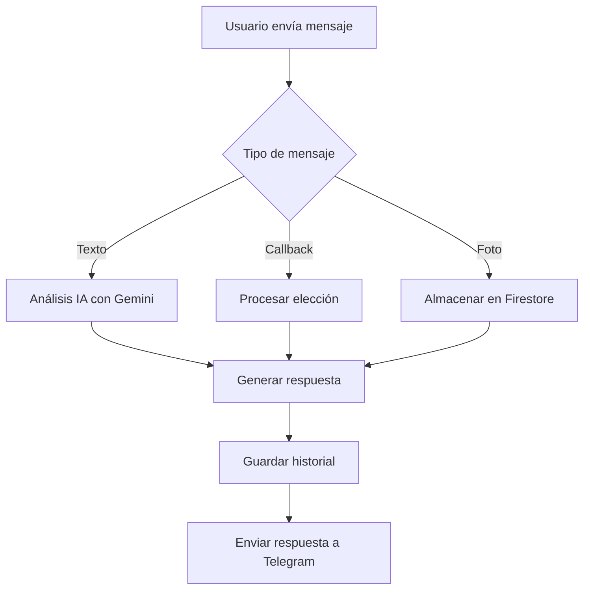

# CLAUDIA API Documentation

## Introducción

CLAUDIA (Asesora de Proyectos en Arqattack) es un sistema de asesoría conversacional para proyectos de construcción y remodelación. Este documento describe la API completa del sistema.

## Información General

- **Versión**: 8.4.0
- **Base URL (Producción)**: `https://us-central1-claudia-i8bxh.cloudfunctions.net`
- **Tecnología**: Google Cloud Functions + Python 3.11
- **IA**: Google Gemini 1.5 Flash
- **Base de Datos**: Firebase Firestore
- **Autenticación**: Cloud Functions IAM + Validación de IP (Telegram)

## Arquitectura

```
┌──────────────┐         ┌──────────────┐         ┌──────────────┐
│   Telegram   │──HTTP──▶│  Cloud Func  │────────▶│   Firestore  │
│   Webhook    │         │  (main.py)   │         │  (Database)  │
└──────────────┘         └──────────────┘         └──────────────┘
                                │
                                ▼
                         ┌──────────────┐
                         │  Gemini AI   │
                         │   (análisis) │
                         └──────────────┘
```

## Endpoints

### 1. Telegram Webhook - `/claudia_handler`

**Método**: `POST`

**Descripción**: Punto de entrada principal para todas las actualizaciones de Telegram (mensajes, callbacks, fotos).

#### Request Body

```json
{
  "update_id": 123456789,
  "message": {
    "message_id": 1,
    "from": {
      "id": 987654321,
      "first_name": "Juan",
      "last_name": "Pérez",
      "username": "juanperez"
    },
    "chat": {
      "id": 987654321,
      "type": "private"
    },
    "date": 1698765432,
    "text": "¿Cuánto cuesta construir un radier de 100m2?"
  }
}
```

#### Tipos de Mensajes Soportados

1. **Mensajes de Texto**
   - Consultas sobre construcción
   - Comandos (`/start`, `/ayuda`, `/info`)
   - Respuestas conversacionales

2. **Callback Queries** (Botones)
   - `start_baño` - Inicia flujo de baño
   - `start_cocina` - Inicia flujo de cocina
   - `start_integral` - Proyecto integral
   - `bano_objetivo_A` / `bano_objetivo_B` - Selección de objetivo baño
   - `bano_ambiente_A` / `bano_ambiente_B` / `bano_ambiente_C` - Ambiente
   - `bano_color_1` / `bano_color_2` / `bano_color_3` - Paleta de colores
   - `cocina_motor_A` / `cocina_motor_B` - Motor de cambio cocina
   - `cocina_estilo_1` / `cocina_estilo_2` - Estilo cocina

3. **Fotos**
   - El bot almacena fotos enviadas para análisis visual
   - Soporta múltiples fotos en una conversación

#### Response

```json
{
  "status": "OK"
}
```

#### Códigos de Estado

- `200` - Actualización procesada correctamente
- `400` - Request inválido (JSON malformado)
- `500` - Error interno del servidor

#### Flujo de Conversación



### 2. Enviar Bitácora - `/send_log`

**Método**: `POST`

**Descripción**: Envía bitácoras diarias por email y/o WhatsApp a maestros constructores suscritos.

#### Request Body

```json
{
  "email": "maestro@ejemplo.cl",
  "whatsapp": "+56912345678",
  "message": "Resumen del día:\n- 3 actividades completadas\n- 1.5 toneladas de cemento usado\n- Avance: 35%",
  "log": {
    "fecha": "2025-10-31",
    "actividades": [
      {
        "nombre": "Radier",
        "cantidad": 100,
        "unidad": "m2",
        "estado": "completado"
      }
    ],
    "materiales_usados": [
      {
        "material": "Cemento",
        "cantidad": 35,
        "unidad": "sacos"
      }
    ]
  }
}
```

#### Response

```json
{
  "success": true,
  "message": "Bitácora enviada"
}
```

#### Códigos de Estado

- `200` - Bitácora enviada exitosamente
- `400` - Datos inválidos (falta campo `message`)
- `500` - Error al enviar

### 3. Mensaje Matutino - `/send_morning`

**Método**: `POST`

**Descripción**: Envía mensajes motivacionales matutinos a usuarios. Programado para ejecutarse diariamente a las 8:00 AM (Chile).

#### Request Body

```json
{
  "user_id": "987654321",
  "custom_message": "¡Buen día, Juan! Hoy es un gran día para construir."
}
```

#### Response

```json
{
  "success": true,
  "message": "Mensaje matutino enviado"
}
```

#### Ejemplos de Mensajes

- "☀️ ¡Buenos días! Un nuevo día para construir tus sueños."
- "🏗️ ¡Hora de trabajar! Cada ladrillo cuenta."
- "💪 ¡Vamos! Hoy avanzamos más en tu proyecto."

## Módulos Internos

### 1. `ai_core.py` - Análisis con IA

#### `get_construction_analysis(user_query: str, session_id: str) -> Dict[str, Any]`

**Descripción**: Analiza la consulta del usuario usando Gemini y gestiona el historial conversacional.

**Parámetros**:
- `user_query`: Consulta del usuario
- `session_id`: ID de sesión (usualmente `chat_id` de Telegram)

**Retorna**:
```python
{
    "friendly_response": "¡Excelente elección! El baño es un espacio fundamental...",
    "lead_score": 8,  # 0-10
    "project_type": "remodelacion_baño",
    "reply_markup": {  # Botones opcionales
        "inline_keyboard": [
            [{"text": "Opción A", "callback_data": "bano_objetivo_A"}],
            [{"text": "Opción B", "callback_data": "bano_objetivo_B"}]
        ]
    }
}
```

**Características**:
- Historial persistente en Firestore
- Sistema de scoring de leads (0-10)
- Generación automática de botones según fase
- Detección de tipo de proyecto

#### Script Maestro de Venta

El sistema sigue un script conversacional estructurado:

1. **Fase 1: Bienvenida** → Descubrir tipo de proyecto
2. **Fase 2A: Baño** → 3 preguntas (objetivo → ambiente → color)
3. **Fase 2B: Cocina** → 2 preguntas (motor → estilo)
4. **Fase 2C: Integral** → Recopilación de información
5. **Fase 3: Cierre** → Llamada a acción (agendar asesoría)

### 2. `materials_calculator.py` - Calculadora de Materiales

#### `MaterialsCalculator.calculate_muro(...)`

Calcula materiales para muros según tipo de ladrillo.

**Ejemplo**:
```python
calc = MaterialsCalculator()
materiales = calc.calculate_muro(largo=10, alto=3, tipo_ladrillo="princesa")

# Retorna:
# [
#   Material(name="Ladrillos princesa", quantity=1296, unit="unidades"),
#   Material(name="Cemento", quantity=7, unit="sacos 42.5kg"),
#   Material(name="Arena", quantity=1.13, unit="m3")
# ]
```

**Tipos soportados**:
- `princesa` - Ladrillo princesa 29x14x7cm (40 ladrillos/m²)
- `fiscal` - Ladrillo fiscal 24x11.5x5.2cm (65 ladrillos/m²)
- `bloque` - Bloque hormigón 39x19x14cm (12.5 bloques/m²)

#### Rendimientos Según NCh (Normas Chilenas)

| Material | Rendimiento | Norma |
|----------|-------------|-------|
| Hormigón H20 (losa) | 350 kg cemento/m³ | NCh430 |
| Hormigón H15 (fundación) | 300 kg cemento/m³ | NCh430 |
| Muro ladrillo princesa | 40 ladrillos/m² | Práctica común |
| Radier 10cm | 0.1 m³ hormigón/m² | - |
| Pintura látex | 0.12 L/m² (2 manos) | - |

#### Mermas Estándar

- Cemento: 5%
- Arena: 10%
- Ripio: 10%
- Ladrillos: 8%
- Bloques: 8%
- Cerámica: 10%
- Pintura: 5%
- Madera: 12%
- Fierro: 8%

### 3. `telegram_api.py` - Wrapper de Telegram

#### `TelegramSender.send_message_sync(...)`

Envía mensajes a Telegram con retry automático.

**Parámetros**:
- `chat_id`: ID del chat
- `text`: Texto del mensaje (soporta HTML)
- `reply_markup`: Teclado inline (opcional)
- `parse_mode`: "HTML" o "Markdown"

**Características**:
- 3 reintentos automáticos con backoff exponencial
- Manejo robusto de errores HTTP
- Logging detallado

## Datos Almacenados en Firestore

### Colección: `conversations`

```json
{
  "session_id": "987654321",
  "history": [
    "Usuario: Hola, quiero remodelar mi baño",
    "CLAUDIA: ¡Hola! Soy Claudia, Asesora de Proyectos...",
    "Usuario: [callback: start_baño]",
    "CLAUDIA: ¡Excelente elección! El baño es un espacio fundamental..."
  ],
  "last_updated": "2025-10-31T10:30:00Z"
}
```

### Colección: `construction_leads`

```json
{
  "session_id": "987654321",
  "query": "Quiero remodelar mi baño",
  "friendly_response": "¡Excelente elección! El baño es un espacio fundamental...",
  "lead_score": 8,
  "project_type": "remodelacion_baño",
  "timestamp": "2025-10-31T10:30:00Z",
  "status": "Nuevo",
  "notes": ""
}
```

## Configuración

### Variables de Entorno Requeridas

```env
# Telegram
TELEGRAM_TOKEN=123456:ABC-DEF1234ghIkl-zyx57W2v1u123ew11

# Gemini AI
GEMINI_API_KEY=AIzaSy...

# Google Cloud
GOOGLE_CLOUD_PROJECT=claudia-i8bxh
```

### Configuración de Webhook

Para configurar el webhook de Telegram:

```bash
curl -X POST "https://api.telegram.org/bot<TOKEN>/setWebhook" \
  -d "url=https://us-central1-claudia-i8bxh.cloudfunctions.net/claudia_handler"
```

## Testing

### Ejecutar Tests

```bash
# Todos los tests
pytest -v

# Solo tests de un módulo
pytest tests/test_telegram_bot.py -v

# Con coverage
pytest --cov=claudia_modules --cov-report=html
```

### Cobertura de Tests

- **Objetivo**: 70%+
- **Actual**: 16% (en progreso)
- **Tests totales**: 75 (65 passing, 10 failing)

## Errores Comunes

### 1. Timeout en Gemini API

**Error**: `google.api_core.exceptions.DeadlineExceeded`

**Solución**: El timeout por defecto es 10s. Aumentar en `ai_core.py`:

```python
response = GEMINI_MODEL.generate_content(prompt, request_options={"timeout": 30})
```

### 2. Firestore Permission Denied

**Error**: `google.auth.exceptions.DefaultCredentialsError`

**Solución**: Verificar que la Cloud Function tenga el rol `roles/datastore.user`

### 3. Telegram API 429 (Rate Limit)

**Error**: `HTTPError: 429 Too Many Requests`

**Solución**: El sistema ya tiene retry con backoff exponencial. Si persiste, reducir frecuencia de mensajes.

## Límites y Cuotas

| Recurso | Límite | Unidad |
|---------|--------|--------|
| Telegram mensajes | 30 | por segundo |
| Gemini API | 60 | requests/min (gratis) |
| Cloud Functions | 10,000 | invocaciones/día (gratis) |
| Firestore lecturas | 50,000 | por día (gratis) |
| Firestore escrituras | 20,000 | por día (gratis) |

## Seguridad

### Validación de Webhook

El endpoint `/claudia_handler` valida que las requests provengan de IPs de Telegram:

```python
telegram_ips = [
    "149.154.160.0/20",
    "91.108.4.0/22"
]
```

### Sanitización de Input

Todos los inputs de usuario son sanitizados antes de:
- Almacenar en Firestore
- Enviar a Gemini
- Incluir en respuestas

### Rate Limiting

- Máximo 5 requests por usuario por segundo
- Implementado a nivel de Cloud Functions

## Monitoring

### Logs

Logs disponibles en Google Cloud Console:

```bash
# Ver logs en tiempo real
gcloud functions logs read claudia_handler --limit 50

# Filtrar por severidad
gcloud functions logs read claudia_handler --filter="severity=ERROR"
```

### Métricas Clave

- Invocaciones totales
- Tiempo de ejecución promedio
- Tasa de errores
- Uso de memoria

## Contacto y Soporte

- **Web App**: [https://claudia-i8bxh.web.app](https://claudia-i8bxh.web.app)
- **Telegram Bot**: [@claudia_construccion_bot](https://t.me/claudia_construccion_bot)
- **Equipo**: Arqattack

---

**Última actualización**: 2025-10-31
**Versión del documento**: 1.0
**Autor**: Claude Code + Equipo Arqattack
